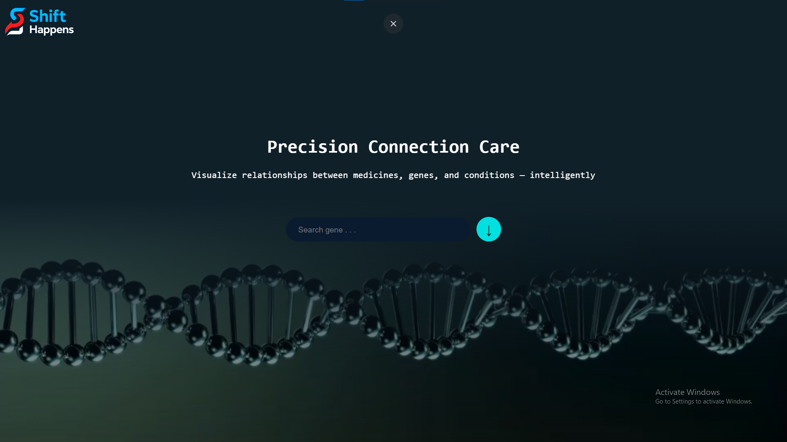

# Gene Explorer: Drug Repurposer App

###  1st Place – PoliHack v17 (AppDev Division)
---

## Overview

**Gene Explorer** is a cross-platform application developed as part of **PoliHack v17**, under the **AppDev division**, where it proudly earned **1st place**. 

Its main objective is to support researchers, bioinformaticians, and healthcare professionals in **exploring the complex relationships between human genes and pharmaceutical compounds**.

The application is fully responsive and can be accessed seamlessly across **desktop, tablet, and mobile devices**, making it adaptable for both field work and research labs.

By integrating interactive data visualizations and AI-powered tools, the platform enables users to identify promising opportunities for **drug repurposing** — the process of discovering new therapeutic uses for existing medications.

---

## Team Members

We are a team of five students passionate about technology, innovation, and biomedical research. Our group includes **three 3rd-year students** and **two 2nd-year students** from the Faculty of Computer Science.

> **Team Lead:** *Ruse Teodor* – responsible for coordinating development, UI/UX direction, and integration between components.


| Name          | Year of Study                |
|---------------|------------------------------|
| **Balahura Vlad** | 2nd year – Computer Science  |
| **Moga Antonia - Teodora**    | 2nd year – Computer Science  |
| **Ruse Teodor**  | 3rd year – Computer Science  |
| **Rusu Dana**   | 3rd year – Computer Science  |
| **Stan Ariana - Maria**  | 3rd year – Computer Science  |


---

## Key Features

- **Gene Search** – Enter any human gene to begin exploring its biological and pharmaceutical context.
- **Drug Repurposing Engine** – Discover existing drugs with high interaction potential based on gene-specific data.
- **Interactive 3D Graph** – Visualize complex gene–drug networks through a dynamic, node-based interface.
- **BioGPT-powered Chatbot** – Ask biomedical questions in natural language and receive real-time answers from an AI assistant.
- **Gene Details Panel** – Access structured data including nomenclature, functional role, genomic location, and known aliases.
- **Drug Insights** – View enriched information about suggested drugs, including usage context, interaction score, and scientific summaries.
- **Cross-Platform Ready** – Fully responsive and optimized for both desktop and mobile devices.

---

## Application Architecture

```plaintext
root/
│
├── public/
│   ├── datasets
│   ├── video_prima_pg.mp4
│   ├── logo-shift-happens.png
│   ├── chatbot-icon.png
│   └── img_prima_pg.jpg
│
├── imgReadMe/                        # Images for README.md visual flow  
│
├── src/
│   ├── index.js                      # Entry point – renders App
│   ├── App.js                        # Main app logic & state
│   ├── App.test.js                   # Basic test setup
│
│   ├── DA/                           # Frontend components
│   │   ├── Page1.js                  # Landing page
│   │   ├── Page2.js                  # Graph + drug view
│   │   ├── Chatbot.js                # AI chatbot (BioGPT)
│   │   └── formatBioGPTResponse.js   # Chat output formatter
│
│   ├── TV/                           # Data & logic layer
│   │   ├── GeneInfo.ts               # Gene info (NCBI)
│   │   ├── GeneCode.ts               # KEGG gene codes
│   │   ├── GenetoDrugDetails.ts      # Drug interactions (DGIdb)
│   │   ├── GeneToNetwork.ts          # Gene to network (KEGG)
│   │   ├── GraphData.ts              # Graph builder (nodes/links)
│   │   ├── moreDrug.ts               # Drug info (FDA)
│   │   ├── MyGraph.js                # 3D graph component
│   │   └── NeworkNameMembers.ts      # Parse network relationships
│
│
├── proxy.js              # API proxy for backend requests
├── proxy_bigBoss.js      # Main backend proxy (KEGG endpoints)
├── package.json          # Project dependencies and scripts
└── README.md             # Project documentation and setup guide
```


##  Flow Vizual

| Homepage | Gene & Graph View | Gene Details | Drug Details | Chatbot |
|----------|--------------------------|---------------------|---------|------|
|  | .png) | .png) | .png) | .png) |


---
##  AI Chatbot – Shifty

The application integrates an intelligent biomedical assistant called **Shifty**, powered by **BioGPT**. Users can interact in natural language to retrieve information about genes, conditions, and preventative measures.

### Example Prompts:
- *"How do I prevent breast cancer?"*
- *"What is the function of BRCA1?"*
- *"What drugs interact with gene SRC?"*

---

##  Technologies Used

| Layer         | Stack / Tools                            |
|---------------|-------------------------------------------|
| Frontend      | React.js, CSS Modules, ForceGraph3D       |
| Backend       | Node.js, Express, custom proxy servers    |
| AI Component  | BioGPT (via local HTTP endpoint)          |
| Data Sources  | KEGG REST API, DGIdb GraphQL, FDA API     |
| Build Tools   | Vite, npm                                 |
| Dev Tools     | Visual Studio Code, Jest, React Testing Library |


---

##  Setup & Local Installation

### 1. Clone the Repository

```bash
git clone https://github.com/AriiSM/PoliHack_V17.git
cd poli_hack
```

### 2. Install Dependencies

```bash
npm install --legacy-peer-deps
``` 

### 3. Run the Frontend

```bash
npm run dev
``` 

### 4. Install & Configure LM Studio (for Shifty AI features)

To enable AI functionality in **Shifty**, you need to run a local LLM API using [**LM Studio**](https://lmstudio.ai/).


#### Steps:

1. **Download LM Studio** 
2. Open the application and go to the **Models** tab.
3. In the search bar, find and download the following model: akhilanilkumar_-_biogpt-baseline-gguf/biogpt-baseline.Q4_K_S.gguf
4. Once the model is downloaded, navigate to the **Server** tab.
5. Select the downloaded model and click **Start Server**.

    ##### Configuration Notes:
   - Make sure the API server runs on: `http://localhost:1234`
   - You can leave the default settings, unless you need a custom port.

    Shifty will now be able to connect and interact with the local model using this endpoint.

